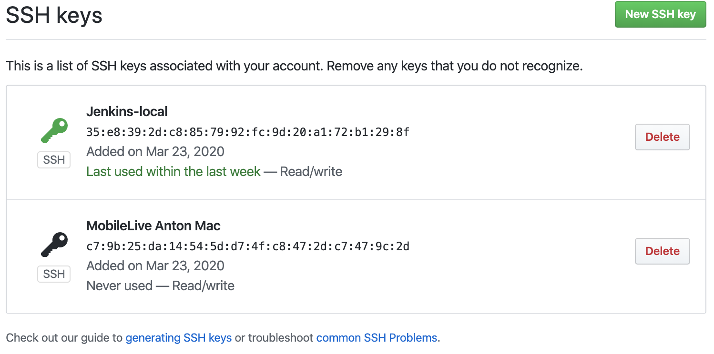
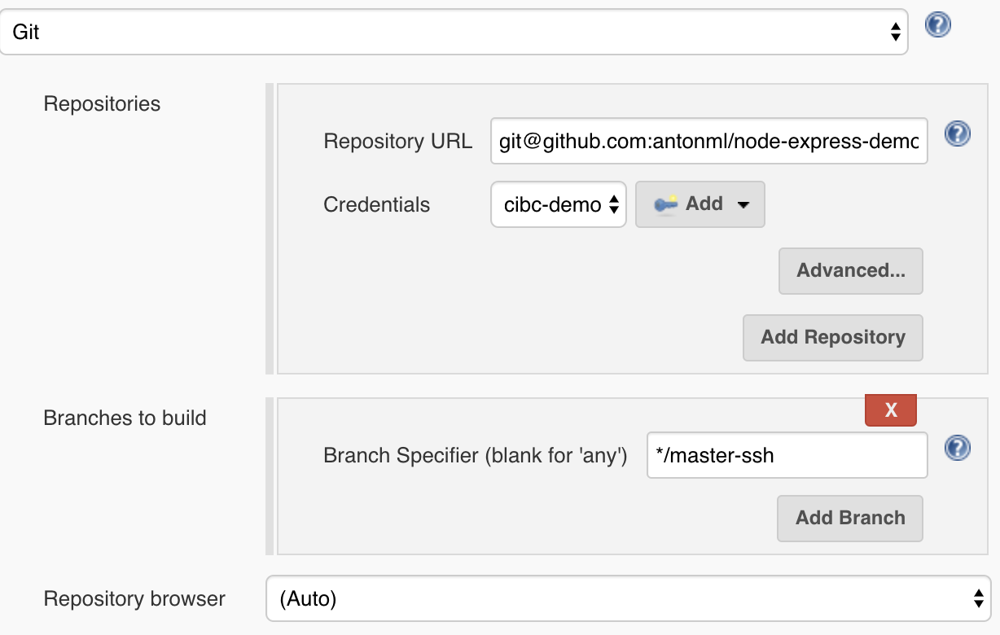
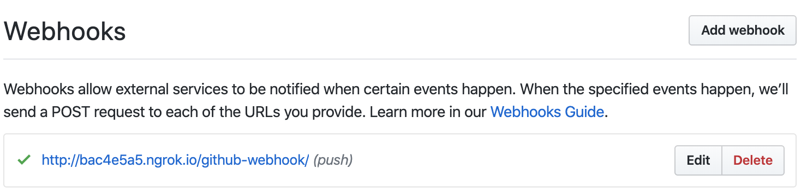
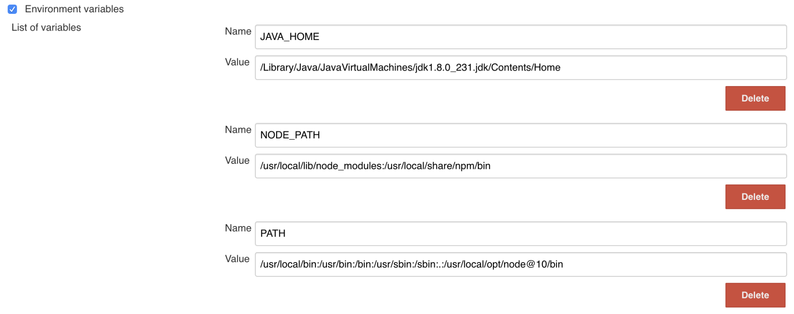
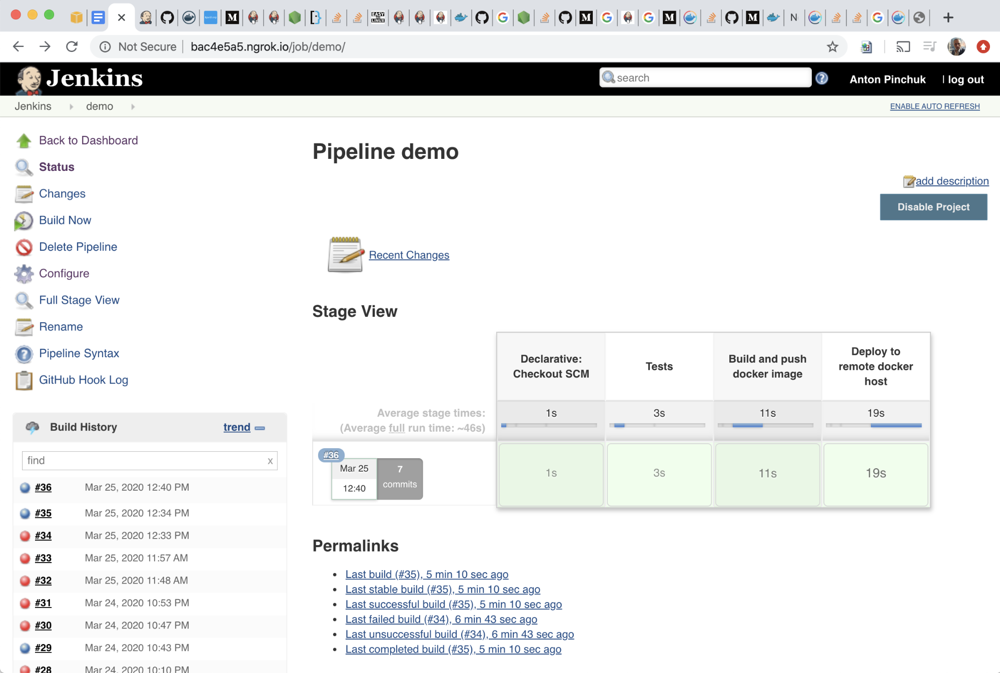
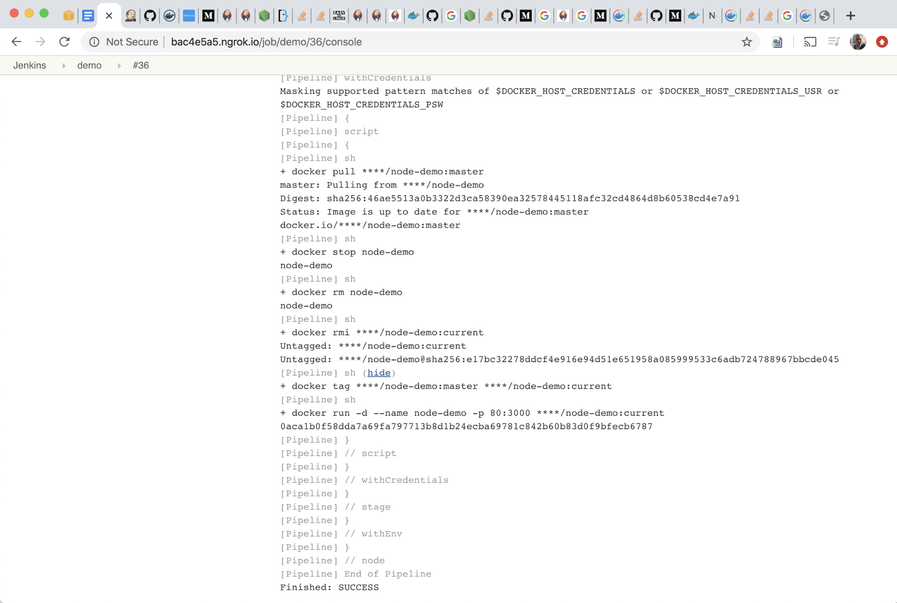
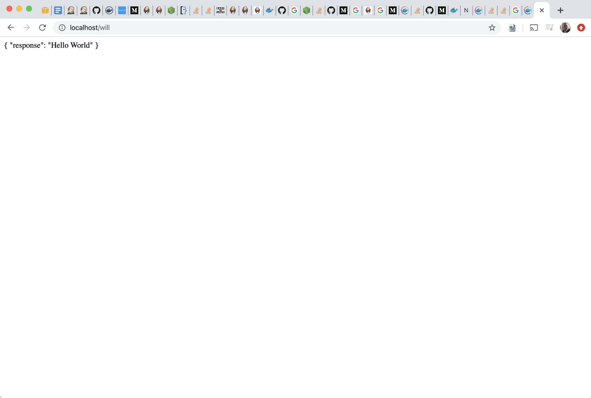

# CI/CD NodeJS, Jenkins and Docker Setup Tutorial

## Overview

Below stuff took me 2 days to complete, just because I was new to Jenkins and stuck with a couple of basic configuration things (hope this article will help you to save your time). 

This tutorial is tight, requires understanding of DevOps fundamentals, plz refer to corresponding documentation for more details.

## Challenge
This tech challenge is composed of three parts: development, container creation and CI/CD.
* First, we create a very basic server application using Node.js and wrap into Docker container
* As a second step, install and configure Jenkins
* Third, create a CI/CD pipeline with Jenkins to build, run tests and push image to Docker registry
* Lastly, to complete deployment, call host docker API to pull image from registry

## Jenkins

I installed it on MacOS using [homebrew](http://brew.sh). _I also played with running it as a Docker container. A challenge part here was that my pipeline runs docker build, that cause 'docker in docker', which is possible, but tricky (see below)._ 

In real life you most likely run Jenkins on VPS or private server with Ubuntu/Debian where configuration is pretty similar to what I've done here.  

Because I need github to access my local jenkins from outside I've set up [ngrok](https://ngrok.com/), which was pretty easy to do, I installed it with homebrew as well.

Run & configure Jenkins (Wizard), uncheck unnecessary plugins (like gradle) and check whatever required for my task:
* Git
* Credentials
* NodeJS
* Pipeline

Generate and setup git ssh credentials, so your machine able to access the repo:

Setup webhook on github to call your jenkins endpoint, like this

#### Configure PATH's 
Use Jenkins global environment settings (e.g. to access enable npm, docker etc). Put here everything that you need to run SSH commands in your pipeline (if it does not work from the box).

But this was not enough. Jenkins plugins, such as [docker](https://plugins.jenkins.io/docker-plugin/), do execute system commands right from Java runtime and do not use Jenkins agents / global settings! So in my case some extra PATH configuration to Jenkins runtime was needed to make it work. On MacOS there is .plist config I amended (.json on linux):
~~~
    <key>EnvironmentVariables</key>
    <dict>
      <key>PATH</key>
      <string>/usr/local/bin:/usr/bin:/bin:/usr/sbin:/sbin</string>
    </dict>
~~~ 

## Jenkins pipeline

Create a new pipeline job.

Check “hook trigger for Scm”, add repository url (with ssh credentials or token) and specify  “master” branch to trigger.

Create [Jenkinsfile](https://github.com/antonpinchuk/node-jenkins-demo/blob/master/Jenkinsfile) pipeline with a build/testing stage:
~~~
            steps {
                echo 'Building..'
                sh 'npm install'
                echo 'Testing..'
                sh 'npm test'
            }
~~~

Use node docker image agent for build and tests:
~~~
            agent {
                docker {
                    image 'node:10-stretch'
                }
            }
~~~
or you can run your shell commands inside the docker container:
~~~
                script {
                   docker.image('node:10-stretch').inside { c ->
                        echo 'Building..'
                        sh 'npm install'
                        echo 'Testing..'
                        sh 'npm test'
                        sh "docker logs ${c.id}"
                   }
                }
~~~

## Build Docker image

Create [Dockerfile](https://github.com/antonpinchuk/node-jenkins-demo/blob/master/Dockerfile) for node image.

Add build stage to your pipeline:
~~~
            steps {
                echo 'Deploying....'
                node {
                    def customImage = docker.build("antonml/node-demo:master")
                }
            }
~~~

## Push docker image
Create Jenkins credentials for your docker hub registry, with type username/password, where id is `docker-demo` instead.

Add build stage:
~~~
                    docker.withRegistry('', 'demo-docker') {
                        dockerImage.push('master')
                    }
~~~

## Pull and run image on target docker host

Create another user/password credentials for remote docker, `demo-docker-host`.

Add build stage:
~~~
        stage('Deploy to remote docker host') {
            environment {
                CREDENTIALS = credentials('demo-docke-hostr')
            }
            steps {
                script {
                    sh 'docker login -u $CREDENTIALS_USR -p $CREDENTIALS_PSW 127.0.0.1:2375'
                    sh 'docker pull antonml/node-demo:master'
                    sh 'docker stop node-demo'
                    sh 'docker rm node-demo'
                    sh 'docker rmi antonml/node-demo:current'
                    sh 'docker tag antonml/node-demo:master antonml/node-demo:current'
                    sh 'docker run -d --name node-demo -p 80:3000 antonml/node-demo:current'
                }
            }
        }
~~~

Connecting to remote docker host (in my case docker host on my local machine). I used pure docker commands, because Docker plugin’s functionality is limited to implement this. If I have more time I would try [docker-build-step](https://plugins.jenkins.io/docker-build-step/).

This solution is not typical for production systems. In large projects of real world images are being delivered to kubernetes, docker swarm, elastic beanstalk or other cloud platforms like digitalocean or heroku. For smaller projects hosted by VPS you may not needed docker, just upload application artifacts directly via SSH (see article below).

## Result (screenshots)

Run deployed project from the container
 

## Technical issues (stoppers)

#### Install Jenkins in a docker container

This tech challenge is supposed to wrap a node app in a docker image. I needed NPM and Docker working with my Jenkins. There are 3 ways to get it working in docker container. 
- Bind the tool from host machine (I tried, but got an error checking docker license)
- Install the tool separately from package inside the container (some people do it, some do not recommend)
- Run the tool (node) in a docker image as an agent, I needed working docker for this, I didn't ((

[See discussion thread](https://forums.docker.com/t/docker-not-found-in-jenkins-pipeline/31683/16)

I tried to use both blueocean image from docker.io and [LTS](https://github.com/jenkinsci/docker/blob/master/README.md) image from github
~~~
docker network
docker volume create jenkins-docker-certs
docker volume create jenkins-data
docker container run \
                   --name jenkins \
                   --rm \
                   --detach \
                   --network jenkins \
                   --env DOCKER_HOST=tcp://docker:2376 \
                   --env DOCKER_CERT_PATH=/certs/client \
                   --env DOCKER_TLS_VERIFY=1 \
                   --publish 88:8080 \
                   --publish 50000:50000 \
                   --volume jenkins-home:/var/jenkins_home \
                   --volume jenkins-docker-certs:/certs/client:ro \
                   jenkins/jenkins:lts
~~~
Trying to run host docker inside docker container mounting executable
~~~
                   --volume $(which docker):/usr/bin/docker \
                   --volume /var/run/docker.sock:/var/run/docker.sock \
                   --volume "$HOME":/home \
~~~

## Resources
*   [Alternative way - deploy artifact to target VPS/container via SSH](https://medium.com/@mosheezderman/how-to-set-up-ci-cd-pipeline-for-a-node-js-app-with-jenkins-c51581cc783c)
*   [Pipeline+Docker - optimize build, run in container, cache dependencies](https://jenkins.io/doc/book/pipeline/docker/)
*   [Wrap node in docker container](https://nodejs.org/en/docs/guides/nodejs-docker-webapp/)
*   [Docker Swarm on local VirtualBox](https://docs.docker.com/swarm/install-w-machine/)
